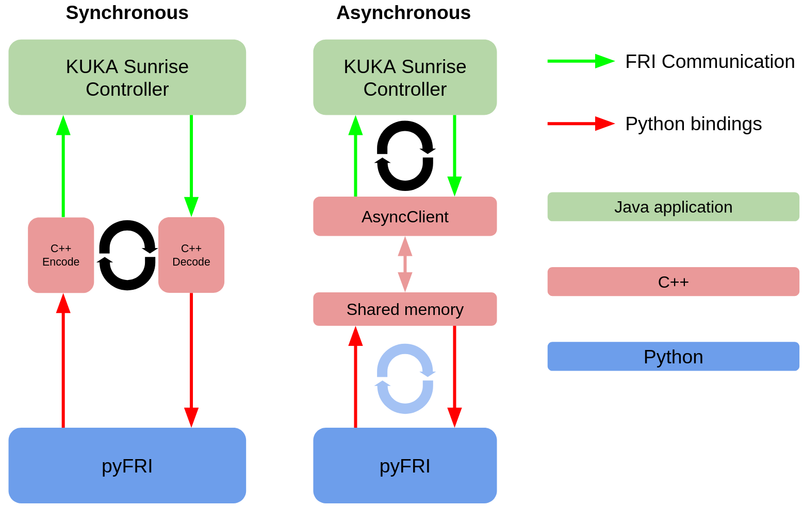

# FRI-Client-SDK_Python

KUKA Fast Robot Interface Python SDK.
The code in this repository, provides Python bindings for the FRI Client SDK C++.
The interface has been designed to be as similar as possible to the documentation provided by KUKA.

There is one difference users of the Python bindings should be aware.
When instantiating the client application, in C++ this is performed as follows.

```cpp
// ..setup client..

// create new udp connection
UdpConnection connection;


// pass connection and client to a new FRI client application
ClientApplication app(connection, client);
```

In Python, the equivalent code is as follows.

```python
import pyFRI as fri

# ..setup client..

app = fri.ClientApplication(client)
```

Since UDP is the only supported connection type and the connection object is not actually required by the user after declaring the variable, the `UdpConnection` object is created internally to the `fri.ClientApplication` class object.

The `pyFRI` library also supports asynchronous execution, see *Execution types* section below.

See the [examples](examples/).

# Important notice

**THIS IS NOT A KUKA PRODUCT.**

[@cmower](https://github.com/cmower) is not affiliated with KUKA.

# Execution types

<p align="center">
  
</p>

Two execution types are supported: (i) synchronous, and (ii) asynchronous.
These are both shown in the figure above.

## Synchronous

This constitutes the operational approach embraced by FRI.
Conceptually, you can envision this approach as executing the subsequent actions:

1. The KUKA controller sends a message to the LBR client over a UDP connection.
2. A response is computed (using some method defined in the client application).
3. The commanded response is encoded and sent back to the controller.
4. The physical robot moves according the command and controller type selected in the Java application.

These steps are repeated at a sampling rate defined in the Java application, e.g. 200Hz.

The pyFRI library abstracts the functionalities of the `ClientApplication` and `LBRClient` classes, enabling users to craft application scripts using classes/functions that mirror the examples provided in the FRI C++ documentation.
An added benefit is the availability of KUKA's FRI documentation for C++, which can serve as a guide for pyFRI users.

The drawback for this approach is the execution loop in the Python application must fit within the sampling frequency set by the Java application.
As such, higher sampling frequencies (i.e. 500-1000Hz) can be difficult to achieve using pyFRI.

## Asynchronous

The pyFRI library incorporates an asynchronous execution approach, allowing users to execute FRI communication at various permissible sampling frequencies (i.e., 100-1000Hz), along with a distinct sampling frequency for the loop on the Python application's end.
The FRI communication on the C++ side is executed on another thread and shared memory between the C++ client and Python application is used to define the target joint states.

In order to ensure smooth robot motion, a PID controller is implemented where the user specifies the set target.
The process variable is executed on the robot using an open-loop PID controller.

The advantage of employing this execution approach lies in the flexibility to configure the controller to operate at the user's preferred frequency, while the Python loop can operate at a lower frequency.
This proves particularly useful during when implementing Model Predictive Control.
However, a downside of this method is the necessity for precise tuning of the PID controller.

# Support

The following versions of FRI are currently supported:
* 1.15
* 2.5

Note, whilst FRI version 2.5 is supported some functionality is not.
Currently, FRI Cartesian Overlay is not supported by FRI-Client-SDK_Python.

If you have a different version, please consider [forking](https://github.com/cmower/FRI-Client-SDK_Cpp/fork) and [submitting a pull request](https://github.com/cmower/FRI-Client-SDK_Cpp/pulls).

# Install

1. Clone repository: `$ git clone --recursive git@github.com:cmower/FRI-Client-SDK_Python.git` (make sure you include `--recursive`)
2. Change directory: `$ cd FRI-Client-SDK_Python`
3. Modify `fri_config.py`: uncomment the line corresponding to your version of FRI.
4. Install: `$ pip install .`

## Upgrading/switching between FRI Versions

If you upgrade your FRI version or want to switch between them, you need to manually remove the `FRI-Client-SDK_Python/build` directory before running `pip install`.

# Usage

## Java application

A flexible Java application is provided [here](https://github.com/cmower/LBR-Java-app).
This must be installed on the KUKA Sunrise controller.

## Data types

You can pass NumPy arrays to the "set" methods (e.g. `setJointPosition`) in order to command the robot.
However, you **must** ensure the format of the array is correct.

Arrays that have a `dtype` of `np.float32` are the only ones that can be accepted.
See how the commands are set in the the examples.

## Collecting data from the robot

We provide additional functionality to the LBR client application class that enables data collection to a text file.
In Python, simply add the following

```python
app = fri.ClientApplication(client)
app.collect_data(file_name)
```

The string `file_name` should contain the file name for the data file.
We use the comma-separated values format for the data file, and so the file name should end with the extension `.csv` - *note*, if this isn't the case then `.csv` is automatically appended to the given file name.

The columns in the recorded csv file are as follows:
* `index`: the index of the recorded data, starts at 0, and is incremented by 1 at each call to the `step` method.
* `time`: the time of the command, starts at 0.0, then is incremented by the sample time at each call to the `step` method.
* `record_time_nsec`: the epoch time collected when the data in the current time step is recorded.
* `tsec`: controller time as specified by the FRI in seconds. See FRI documentation for `getTimestampSec`.
* `tnsec`: controller time as specified by the FRI in nanoseconds. See FRI documentation for `getTimestampNanoSec`.
* `mp1, ..., mp7`: The measured joint position for the robot.
* `ip1, ..., ip7`: The ipo joint position for the robot.
* `mt1, ..., mt7`: The measured torque for the robot.
* `et1, ..., et7`: The external torque for the robot.
* `dt`: The sample time specified on the KUKA controller.

See the [examples/LBRJointSineOverlay.py](examples/LBRJointSineOverlay.py) example that demonstrates how to easily collect data from the robot.

# Examples

First, ensure the corresponding Java applications for each example are installed (these were supplied with KUKA Sunrise).
Then turn on the robot, connect your laptop via ethernet, and follow these steps on your laptop.

1. Change directory: `cd /path/to/FRI-Client-SDK_Python/examples`
2. Run examples
   - `$ python LBRJointSineOverlay.py # based on examples provided by KUKA`
   - `$ python LBRTorqueSineOverlay.py # based on examples provided by KUKA`
   - `$ python LBRWrenchSineOverlay.py # based on examples provided by KUKA`
   - `$ python joint_teleop.py`
   - `$ python task_teleop.py`

# Documentation

You can find documentation for `pyFRI` in the [wiki](https://github.com/cmower/FRI-Client-SDK_Python/wiki).
